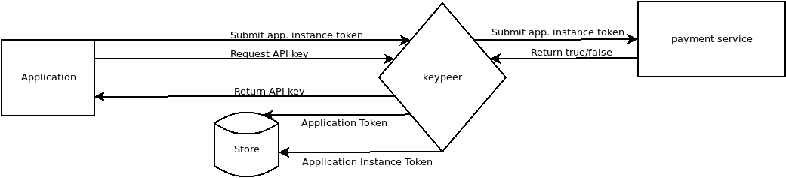

# Abstract: Can you explain the whole project and its expected outcome(s).

The keypeer project provides an API key intermediary service. It aims to serve the following goals:

  * give user communities access to services that would otherwise require proprietary software
  * free developers to provide access to paid services
  * provide a service / application agnostic api to act as an intermediary
  * minimize the storing and transmission of personal data 
  * store keypeer data using modern homomorphic cryptography

Many applications today depend on data and servcies which they do not directly control. Some of this data is freely available like that of the Wikipedia foundation or the Open Street maps project. Much more data is distributed by means that are to difficult or expensive for individual software users, developers or academic researchers to use. When access to proprietary data or services is available it is often made so by means of an application programming interface accessible via protoocls like http, aka the web.

keypeer will enable users to support third party service use in FOSS (free and open source software) applications and to benefit from those services that they might individually not be able to access without sacrificing privacy. Users often lack simple and transparent ways to support a project financially and to combine this with the use of the software.  Often developers simply can't fund the use of third party data or services. Keypeer connects them to users who collectively can supply the financial support.

A birdseye view of the process.

For developers of Free Open Software (FOSS), keypeer enables them to include a paid third party service in their application and enable it for a user who has donated without having an ongoing business relationship and without the project storing that user's personal data. Enabling FOSS application users to pay for services allows them to support services that respect privacy and require significant resources.

## Example API(s)

As an example, many map services require significant data processing and data serving expenses. Although the OpenStreetMaps dataset is freely available, it has to be processed into specific database formats to be served as map tiles and to provide search and routing. Multiple providers exist that are focused in providing privacy respecting service, but the mechanism used for payment of the services is through application API keys which  require the application developer to pay for the service provided to end users. While it is a viable financial model for proprietary applications, FOSS applications lack a mechanism to enable users to directly pay for the service. Keypeer would enable users to contribute a share of the cost of API calls they make.

Other examples of types of services which require keys or proprietary licenses:

  * transportation authorities, which require use of their apps or limit the use of the apis
  * news service providers like Reuters and AP or the aggregator newsapi.org. These charge upward of 450 USD a month. 
  * text-to-speech, speech-to-text services

## Technical Implementation

The technical part consists of a web service (REST API), a freely accessible interface that developers can use for accessing services API keys through keypeer.

Protecting keys is a challenging problem. We propose to use fully homomorphic encryption [OpenFHE](https://en.wikipedia.org/wiki/OpenFHE) for all storage of user and third party key material on servers. See also: [Fast Proxy Re-Encryption for Publish/Subscribe Systems](https://eprint.iacr.org/2017/410) from Polyakov, Rohloff, Sahu, and Vaikuntanthan for some relavant research with concreate implementations in the domain.

The service will be prototyped in the Python and C++ languages, most probably with a framework like Flask and Werkzeug for the api endpoints themselves. Client side code will initially be prototyped in javascript and c++. 

## Social Goals

One of the unique aspects of the keypeer project is that it is not limited to one type of software or user community. Many kinds of software use remote APIs and both user communities of Desktop and Mobile operating systems, even embedded systems in the IOT space can benefit from the use of a keypeer. And so, one goal of the keypeer project is to network with different projects and apply network effects to aid in financial support in a commons. Some API keys, and hence funding, can be supported by groups which otherwise don't have much in common. The mapping example above extends across users of desktop applications and mobile phone apps including mutltiple operating systems.

Another of the goals keypeer has is to create a transparent means for users and developers to observe the financial aspects of the operation of keypeer and the use of the API keys themselves.

keypeer will not accept payment for services as in a taditional subsription model but rather allocate means managed independantly.  Management of the payments will be done by a not-for-profit association using a transparent intermediary.

Some examples of transparent financial intermediaries: [Open Collective](https://opencollective.com/europe). [Commons Conservancy](https://commonsconservancy.org/) [Transnational Giving](https://www.transnationalgiving.eu/)

## Financial Development

We wish to follow a multi-pronged funding strategy. Obviously, we wish to enable individual users to contribute on a use base. We also intend to do traditional recurring funding drives. There should, however, also be a possibility to enlist corporate support. Given that keypeer can simplify and secure use of high values secrets which can be of great use within an organization that subscribes to multiple services, we anticipate being able to enlist corporate donors/sponsors. As a first step, we will approach companies like mapbox and maptiler to guage interest.

# Requested amount  50000

# Explain what the requested budget will be used for? 

The budget will cover personal expenses, consulting (legal & security), communication & PR , server hosting, and postage and handling (smiley). 

## Budget

2000 - 4000 :  API access 6 months, for a 'live' test period (assuming mapbox, maptiler, stadia and newsapi.org)
In order to test the system under load, it will require live data.

100 / month x 6  : server hosting, minor expenses

24000 - 6 months developer time (part time, 20 hours a week, 50 Euro/h). 

1-2000 - Consulting with API service providers and payment processors, collectives, etc.

1-2000 - legal consulting. We will no doubt need to do legal risk assesments as also the following.

5-10000 - Independant Audit. A proper final audit of the code could easily cost more.

# Compare your own project with existing or historical efforts.

This is a first, we believe. Which is also why we're doing it since we have no other option.

# What are significant technical challenges you expect to solve during the project, if any?)

The design of the system poses a number of challenges. Some api's can only use single api keys, some can issue ephemeral keys.  This leads rise to a need to support metering of use or dynamic allocation of short lived keys depending on the service provider. 

We anticipate supporting developers of diverse types of software in integrating keypeer will be the most time consuming challenge.

Beside having to support different patterns in application usage, we will also be facing issues with traditional financial models and payment processing. Connecting securely to payment services without sacrificing use anonymity while also being able to do necessary 'accounting' will no doubt be a technical challenge.

Other technical challenges may include homomorphic cryptography of the user / key store. Since multiple high value keys need to be stored, the value store must be entirely encrypted with a scheme like Fast Proxy Re-Encryption for Publish/Subscribe (see: https://eprint.iacr.org/2017/410).

# Describe the ecosystem of the project, and how you will engage with relevant actors and promote the outcomes?

A number of people and projects are already taking part in the discussion. Most important for the purposes of prototyping at this stage are:

https://github.com/rinigus/pure-maps which will be used for testing a number of api's, including maptiler and mapbox, concurrently

Regarding pure maps: which will be used for testing a number of API's for accessing map data, such as MapTiler and Stadia, concurrently.

As soon as the first stage is ready, we will engage with the other mapping applications (Gnome Maps, uNav, and others). We will promote this new opportunity in relevant mobile and desktop linux and other FOSS communities.

https://github.com/poetaster/allthenews which may be used for testing with the newsapi.org apis.

